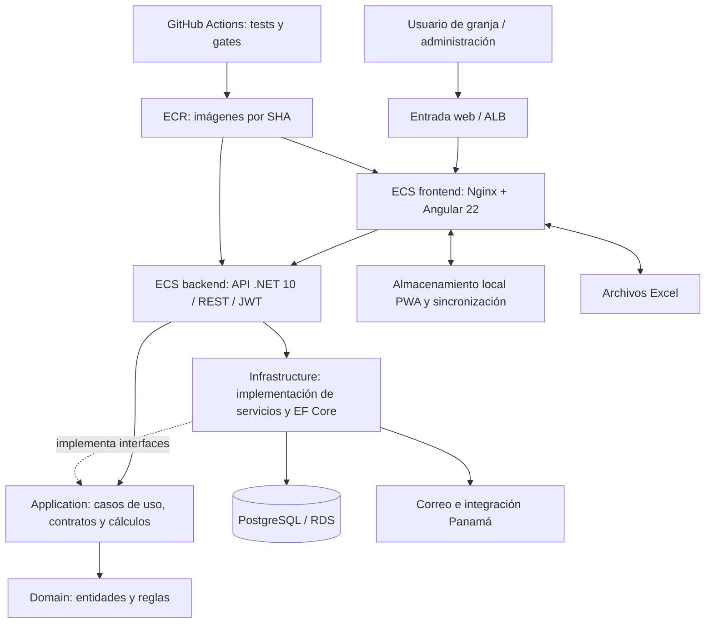

# Anexo interno — revisión técnica preliminar

Conservado como evidencia de la revisión inicial. No usar sus listas como pendientes funcionales vigentes: el responsable confirmó ERP como pendiente funcional web y móvil en desarrollo (80–90 % estimado). Los hallazgos técnicos necesitan un backlog separado y revalidación; esta copia no constituye ese inventario exhaustivo.

---

# Guía de reunión — ItalGranja / San Marino

Fecha de corte: 14 de septiembre de 2026. Duración: 30 minutos. Fuente principal: código actual, tracker y evidencia de GitHub Actions. Documento para exposición; no representa certificación integral de producción.

## 1. Resumen ejecutivo

ItalGranja centraliza la gestión avícola de empresas, granjas, núcleos, galpones y lotes para mantener trazabilidad de aves, alimento y huevos durante levante, producción y engorde. La necesidad que se desprende de los documentos y módulos es reducir la captura dispersa, las diferencias entre inventario y seguimiento diario y el esfuerzo de consolidar reportes técnicos y de costos, con acceso controlado por empresa y perfil de usuario.

El objetivo principal de la fase actual es consolidar una plataforma ya implementada y desplegada: registrar y validar la operación diaria, consultar existencias e indicadores y adaptar reglas por empresa sin perder consistencia entre módulos. El alcance incluye administración, inventario, seguimiento, movimientos, reportes y capacidades de trabajo sin conexión; el cierre de esta fase requiere validación operativa con usuarios, conciliación de datos y completar los cambios pendientes de publicación. No hay evidencia suficiente para asignar un porcentaje global de avance ni una fecha única de finalización contractual.

## 2. Estado: Hecho vs. Pendiente

### Hecho

- **Administración y perfilamiento implementados:** login, sesiones, empresas, roles, menús, permisos y alcance de granjas. La matriz de módulos por empresa fue incluida en el despliegue del PR #107; permanece pendiente su aceptación visual por usuarios.
- **Estructura productiva implementada:** granjas, núcleos, galpones y lotes de postura, reproductoras y engorde, con etapas y configuración por empresa.
- **Operación diaria implementada:** inventario e ingreso de alimento, silos, seguimiento de levante y producción, mortalidad, consumo y pesajes; movimientos y traslados de aves y huevos.
- **Varios registros por día:** captura y tratamiento de indicadores, pesajes y costos según configuración empresarial. Las correcciones integradas para Santa Reyes llegaron al despliegue del PR #108; no implican habilitación indiscriminada en todas las empresas.
- **Resultados implementados:** reportes contables, técnicos, costos de postura/engorde, indicadores y exportaciones Excel. El porcentaje de producción ave-día fue corregido y documentado como desplegado en el PR #105.
- **Capacidades complementarias presentes en código:** vacunación, tickets/ItalJira, implementación, sincronización Panamá y PWA/offline. Su presencia no equivale a aceptación funcional de todos los escenarios.
- **Pruebas comprobadas en CI:** run `34815320884`, 14-sep-2026: 4.248 pruebas de Application y 1 de Domain aprobadas; frontend 894 aprobadas; gates y jobs de despliegue exitosos.
- **Despliegue comprobado mediante logs:** PR #108, commit `30519726237a485fa93041b736792fce8acae110`; backend y frontend con imágenes de ese SHA y `rolloutState=COMPLETED`, a las 07:04 y 07:09 UTC del 14-sep. Es evidencia de finalización del despliegue, no una consulta nueva al estado vivo de ECS.
- **Arreglo posterior implementado localmente:** commit `8ee486a`, CompanyId/auditoría y bloqueo de reversión de traslados TSD; tracker registra 4.260 pruebas Application + 1 Domain. Estos últimos resultados son históricos del tracker, no una nueva ejecución durante esta revisión.

### Pendiente

- **Publicar el arreglo TSD:** está fuera del SHA desplegado. Antes de desplegar, medir el backfill contra un dump fresco de producción y revisar su efecto en saldos; luego autorización y verificación del despliegue.
- **Aceptar visualmente módulos y permisos:** re-login, matriz por empresa y creación de rol con pasos General → Empresas → Permisos. El tracker mantiene este smoke pendiente.
- **Certificar el flujo de demostración:** acceso real del presentador, menús efectivos, lote y fecha admitidos, ingreso y seguimiento persistidos y visibles después de recargar. Los datos existentes por sí solos no certifican esta condición.
- **Actualizar el ambiente local de ensayo:** el último registro de migración observado es `20260912140000_SeedFlagMultiplesSeguimientosSantaReyes`; faltan migraciones posteriores incluidas en el despliegue. La actualización debe coordinarse con quienes usan esta base compartida.
- **Investigar el alcance empresarial de los seguimientos de Demo:** hay registros asociados a lotes de Demo mediante su relación de lote, pero el filtro directo `seguimiento_diario_levante.company_id=4` devuelve cero. No corregir ni copiar esos datos sin determinar la fuente y el contrato de lectura.
- **Revalidar pendientes operativos históricos con responsables:** pruebas PWA de cambio de operario, desconexión prolongada y revocación; aceptación asistida Santa Reyes; definiciones/códigos ERP y conciliaciones con documentos de origen. El tracker los conserva, pero no se verificó su estado actual con el cliente: no presentarlos como defectos nuevos confirmados.
- **Conciliar documentación:** algunos checkboxes antiguos siguen abiertos aunque cambios posteriores los resolvieron (por ejemplo V-X1/V-X2, renombre de consola y despliegues). El README raíz todavía menciona .NET 9. No sumar esos renglones para calcular avance.

**Hoja de ruta propuesta, sin fechas comprometidas:** primero alistar y ensayar Demo; después validar/publicar TSD; luego cerrar aceptación visual y pruebas de campo; finalmente priorizar con negocio los pendientes de datos e integración que sigan vigentes. Responsable sugerido: QA + operación para demo/aceptación, backend + DevOps para publicación y líderes de empresa para datos/reglas.

## 3. Arquitectura y tecnologías

| Elemento | Tecnología y responsabilidad observada |
|---|---|
| Web | Angular 22 standalone, TypeScript 6, RxJS, Tailwind 3, Chart.js; build `@angular/build`, Node 22 en CI |
| Trabajo offline | Angular Service Worker y módulos de caché/sincronización PWA; aceptación en campo pendiente de revalidación |
| API | ASP.NET Core .NET 10, REST, JWT Bearer, middleware de empresa activa, Swagger/OpenAPI y FluentValidation |
| Application | DTOs, interfaces, handlers y cálculos puros; reglas comprobables mediante xUnit |
| Domain | Entidades y reglas de dominio sin dependencias externas |
| Infrastructure | EF Core 10, Npgsql, persistencia y servicios; funciones/vistas/triggers PostgreSQL distribuidos mediante migraciones EF |
| Base de datos | PostgreSQL; RDS documentado en us-east-1; local comprobado en 127.0.0.1:5433 |
| AWS / entrega | GitHub Actions → imágenes Docker en ECR → servicios ECS de frontend y backend, us-east-2; ALB y Nginx |
| Integraciones | Importación/exportación Excel (XLSX, ClosedXML/EPPlus), correo SMTP, reCAPTCHA y sincronización Panamá. Disponibilidad externa no comprobada en esta revisión |

El diagrama combina recorrido de ejecución y dependencias, indicadas en las flechas. Las implementaciones de Infrastructure se inyectan en la API y satisfacen contratos de Application. La separación permite probar cálculos sin BD, mantener autorización por empresa y centralizar saldos/reportes.

**Corrección frente a documentos viejos:** `frontend/nginx.conf` declara ECS/Nginx como origen vigente; el despliegue S3/CloudFront está archivado. No se incluye como ruta activa del frontend. Existe además `zootecnicoapp`, una aplicación móvil separada; no se requiere para esta demo web.

## 4. Demo en vivo — ocho minutos

Mensaje conductor: «Del dato capturado en granja al registro trazable y al reporte».

| Tiempo de demo | Acción del presentador | Resultado que debe mostrar |
|---|---|---|
| 00:00–01:00 | Iniciar sesión con usuario de prueba y elegir Demo. Señalar empresa y perfil. | Inicio autenticado y menú autorizado |
| 01:00–02:00 | Abrir granja y lote previamente ensayados; mostrar fecha, etapa y ubicación. | Contexto productivo correcto |
| 02:00–04:00 | En inventario, registrar un ingreso de alimento con ítem, unidad, cantidad, fecha y referencia de demo. | Confirmación, movimiento listado y existencia actualizada |
| 04:00–06:00 | Abrir seguimiento diario del mismo lote y registrar consumo y variables productivas del ensayo. Guardar y ejecutar la validación si ese perfil y flujo la requieren. | Registro visible con su estado real; explicar captura vs. validación |
| 06:00–07:00 | Recargar la consulta y contrastar seguimiento con inventario. | Persistencia y efecto esperado, sin confundir reserva con consumo validado |
| 07:00–08:00 | Abrir reporte técnico o de costos del mismo lote/rango y mostrar el registro; exportar solo si el ensayo lo permite. | Resultado consultable y trazable |

No improvisar cantidades ni fechas durante la reunión: deben fijarse después del ensayo y satisfacer disponibilidad, reglas de fecha y validación. Un segundo registro el mismo día es una extensión opcional solo con empresa habilitada; no cambiar de empresa para incluirlo en estos ocho minutos.

### Comprobación del ambiente y los datos

Consultas ejecutadas en modo `BEGIN READ ONLY` contra la conexión configurada en `appsettings.Development.json`, sin mostrar credenciales ni modificar filas:

| Comprobación | Resultado del 14-sep |
|---|---|
| PostgreSQL local | Conexión exitosa a `sanmarinoapplocal`, puerto 5433 |
| Empresa Demo | Existe, id 4 |
| Usuarios activos asociados | 3; no se probó su contraseña ni sus permisos efectivos |
| Estructura | 9 granjas y 20 galpones |
| Lotes de levante | 10 filas: 8 en estado Levante y 2 Produccion |
| Existencias | 6 filas positivas: cantidades entre 500 y 49.400 kg; deben cruzarse con el lote/ubicación del ensayo |
| Ejemplo para consulta histórica | LOTE 237, LEVANTE 01, id de etapa 19, cierre Abierto: 12 registros vinculados; último 11-jul-2026 |
| Otros candidatos históricos | LOTE 235A / LA CAROLINA: 9 registros, último 30-jul; LOTE 237A / MONTANEL: 9, último 17-jul |
| Alcance de seguimientos | Los registros por relación de lote contrastan con cero al filtrar directamente por company_id=4; requiere diagnóstico |
| API/frontend locales | No se detectaron listeners en 5002/5501 ni 4200; no se levantaron servicios |
| Docker | Motor Linux no disponible; PostgreSQL local funciona por separado |
| Versión del esquema local | Última migración registrada del 12-sep; no alineada con el despliegue del 14-sep |

**Veredicto: datos de estructura disponibles; demo completa todavía no certificada.** No se creó un lote ni se ejecutaron ingresos de prueba, porque no hay un ambiente de aplicación ensayado y el esquema local requiere alineación. Los candidatos históricos sirven para preparar consulta; no se certifican aptos para registrar con fecha actual.

**Ensayo previo requerido:** coordinar actualización de la base local o elegir ambiente de prueba actualizado; autenticar presentador; comprobar menús de Demo; seleccionar un lote abierto con stock compatible y fecha permitida; fijar una referencia `DEMO-REUNION-20260914`; ejecutar ingreso/seguimiento/validación; recargar y comprobar reporte. Si se inicia un backend local para ello, detenerlo al terminar. No usar datos operativos de otra empresa como sustituto.

**Contingencia:** si el ensayo no está aprobado, sustituir la captura en vivo por consulta histórica previamente autenticada o una grabación real del ensayo. No hay grabación generada en esta entrega. Reservar los ocho minutos y explicar qué validación falta, sin mostrar una confirmación simulada.

## 5. Agenda y guía de exposición (30 minutos)

| Horario | Lámina o bloque de la guía | Idea principal |
|---|---|---|
| 00:00–05:00 | 1. Problema y objetivo | Leer/adaptar los dos párrafos ejecutivos; delimitar fase |
| 05:00–10:00 | 2. Arquitectura | Mostrar Mermaid; explicar web, API, datos, empresa y entrega |
| 10:00–14:00 | 3. Lo realizado | Recorrer capacidades y evidencia CI/despliegue |
| 14:00–18:00 | 4. Pendientes y hoja de ruta | Distinguir publicación TSD, aceptación y preparación de datos |
| 18:00–26:00 | 5. Demo | Seguir los ocho minutos anteriores |
| 26:00–30:00 | 6. Preguntas y acuerdos | Acordar responsable y criterio de cierre de cada pendiente |

Preguntas útiles para cerrar: ¿quién acepta el flujo de captura y validación?, ¿qué empresa y datos usarán en la capacitación?, ¿cuándo se realiza el ensayo?, ¿qué pendientes operativos siguen vigentes? Las fechas se acuerdan en reunión; no se deducen del cronograma antiguo.

## 6. Evidencia y límites de la revisión

- [CI y despliegue comprobados](https://github.com/ItalcolColombia/App_SanMarino/actions/runs/34815320884), [PR #108](https://github.com/ItalcolColombia/App_SanMarino/pull/108).
- `tracker_estado.md`: bloques MOD-PERM, INTEGRACION-RAMAS-13SEP y TSD-COMPANY-ID, además del plan de alistamiento Demo.
- `frontend/package.json`, `frontend/nginx.conf`, `.github/workflows/deploy-production.yml`, proyectos `.csproj` de `backend/src`, módulos en `frontend/src/app/features`.
- `fase_de_desarrollo/demo_lista_practica_carga_masiva_costos_plan.md`: práctica de costos, estructura y restricciones de Demo; se contrastó con consultas actuales, no se asumió ejecutada la limpieza.
- `fase_de_desarrollo/traslado_seg_movimiento_company_id_plan.md`: alcance y gate anterior al deploy de TSD.

Se revisaron código, documentos, Git/CI y datos locales de solo lectura. No se ejecutaron nuevos builds/tests por tratarse de documentación sin cambios funcionales; los resultados citados pertenecen a las ejecuciones identificadas. No se verificaron sesión autenticada en navegador, datos de producción ni estado ECS mediante credenciales AWS en esta sesión. No se calcula avance porcentual a partir de checkboxes históricos.

