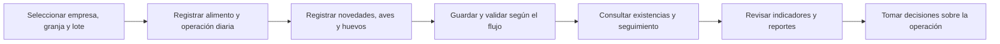
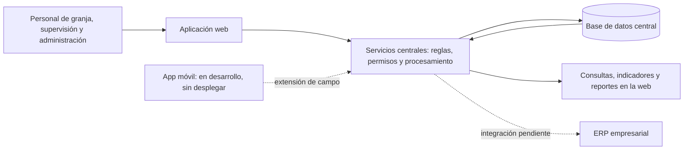

# Guía de reunión — ItalGranja / San Marino

**Duración:** 30 minutos de exposición + 10–15 minutos adicionales de preguntas. **Versión:** 14 de septiembre de 2026, ajustada con el contexto del responsable del proyecto. **Propósito:** explicar qué resuelve la aplicación, cómo acompaña la operación y cuál es su siguiente etapa. Esta guía será la base del PowerPoint.

## 1. Mensaje central

> De la operación de cada granja a información centralizada para hacer seguimiento, controlar la producción y tomar decisiones.

La reunión debe dejar claras tres ideas: la plataforma web acompaña la operación avícola; cada empresa adapta sus flujos y parámetros durante la implementación; la siguiente integración funcional pendiente es el ERP, mientras la app móvil continúa su desarrollo.

## 2. Resumen ejecutivo — problema y objetivo

La operación avícola necesita relacionar lo que ocurre en cada granja, galpón y lote: ingreso y consumo de alimento, novedades, mortalidad, pesajes, movimientos de aves y producción de huevos. Cuando esa información se registra de forma dispersa o se consolida tarde, resulta más difícil conocer existencias, seguir el comportamiento productivo y preparar reportes consistentes. ItalGranja reúne estos procesos en una plataforma con acceso por empresa y perfil, para mantener trazabilidad y facilitar el trabajo de operación, supervisión y administración.

El objetivo de la aplicación es convertir los registros de campo en información disponible para seguimiento y decisión: controlar alimento, aves y huevos, consultar novedades y revisar reportes técnicos, productivos y de costos. La plataforma web está implementada y evoluciona con la operación y las parametrizaciones de cada empresa. Según el estado confirmado por el responsable, el pendiente funcional es la integración con el ERP; en paralelo, la app móvil tiene un avance estimado del 80–90 % y aún no se ha desplegado, a la espera de consolidar su funcionamiento y finalizar la implementación de postura en San Marino.

## 3. Qué hace la aplicación por la operación

| Necesidad de la operación | Cómo la acompaña ItalGranja | Qué puede consultar el equipo |
|---|---|---|
| Organizar la granja | Empresas, granjas, núcleos, galpones y lotes | Ubicación y contexto de cada registro |
| Controlar alimento | Ingresos, inventario, consumo y movimientos | Existencias y trazabilidad del alimento |
| Seguir las aves | Seguimiento diario, mortalidad, pesajes y traslados | Evolución del lote y novedades registradas |
| Controlar la producción de huevos | Registro de producción y clasificación según empresa, movimientos y traslados | Cantidades y trazabilidad de la producción |
| Supervisar la operación | Consultas por empresa, granja, lote y periodo | Información actualizada y novedades operativas |
| Preparar decisiones | Indicadores, reportes técnicos, contables y de costos; exportación Excel | Resultados consolidados para análisis |
| Controlar el acceso | Usuarios, perfiles, roles y permisos por empresa | Información y acciones correspondientes a cada responsabilidad |

**Cómo explicar “información en tiempo real”:** la información queda disponible para consulta conforme se registra, envía y procesa en el sistema, respetando la validación que requiera cada flujo. Una captura sin conexión debe sincronizarse antes de estar disponible para otros usuarios. No presentar esta capacidad como sensores automáticos o actualización instantánea de todas las pantallas.

## 4. Estado del proyecto para presentar

### Plataforma web: implementado

- Administración de empresas, usuarios, perfiles y permisos.
- Estructura de granjas, núcleos, galpones y lotes.
- Ingreso y control de alimento e inventarios.
- Seguimiento diario de levante, postura/producción y engorde según la operación habilitada.
- Registro de novedades, mortalidad, consumos y pesajes.
- Control de huevos de producción, clasificación y movimientos según configuración.
- Movimientos y traslados de aves y huevos.
- Indicadores, consultas y reportes técnicos, productivos, contables y de costos.

### Pendiente funcional: integración con el ERP

La integración con el ERP es el pendiente funcional identificado por el responsable del proyecto. Su objetivo es conectar la información de la operación avícola con el sistema empresarial y reducir la necesidad de volver a registrar información.

El alcance del intercambio, los datos que viajarán, la dirección de la integración, su frecuencia y las validaciones deben acordarse con el equipo responsable del ERP. No se comprometen interfaces, fechas ni automatizaciones específicas en esta reunión. La existencia de códigos ERP o integraciones particulares en el repositorio no equivale a tener concluida esta integración.

### Evolución continua por empresa

Las mejoras que surjan del uso, los ajustes de flujo, las parametrizaciones particulares y los despliegues por empresa forman parte del proceso continuo de implementación. Se priorizan de acuerdo con la operación observada y su impacto; no constituyen una lista adicional de funcionalidades faltantes del alcance presentado.

### Aplicación móvil: en desarrollo

- **Avance estimado: 80–90 %**, informado por el responsable del proyecto; no es una medición de cobertura ni de checkboxes del repositorio.
- **Estado: todavía sin desplegar.**
- Se han incorporado cambios de acuerdo con las necesidades operativas.
- Su finalización y despliegue están ligados a consolidar el flujo y completar la implementación de postura en San Marino.
- Se presentará como extensión de la operación en campo en desarrollo, no como una aplicación ya entregada a los usuarios.

**Frase sugerida:** «La web ya soporta la operación. El pendiente funcional es la integración con el ERP. Continuamos ajustando la plataforma a cada empresa y consolidando la app móvil, que está aproximadamente entre el 80 y el 90 % de avance».

## 5. Flujo operativo fácil de explicar

**Explicación oral:** «Primero ubicamos la operación: empresa, granja y lote. Después registramos lo que sucede, desde el alimento hasta la producción de huevos. El sistema conserva y valida esa información según el proceso, permite hacer seguimiento y la presenta en reportes para que el equipo decida con datos».

**Ejemplo conductor de la presentación:** un ingreso de alimento se registra en inventario; su consumo se captura en el seguimiento del lote; la consulta permite revisar la existencia y el comportamiento productivo; el reporte reúne la información del periodo. Para postura, sumar la producción y clasificación de huevos del mismo contexto.

## 6. Arquitectura: una explicación en dos niveles

### Vista para toda la audiencia

**Explicación oral:** «Los usuarios trabajan desde la aplicación. Los servicios centrales verifican los permisos y procesan las reglas de la operación. La información queda almacenada de forma centralizada y se consulta en seguimiento y reportes. La app móvil ampliará el trabajo en campo y la integración ERP conectará esta operación con el sistema empresarial».

Las líneas discontinuas señalan los elementos que aún no se presentan como entregados. El bloque de reportes representa una capacidad de la aplicación, no un servicio independiente.

### Respaldo técnico breve

| Capa | Tecnología | Explicación sencilla |
|---|---|---|
| Interfaz web | Angular 22, TypeScript 6 y Tailwind 3 | Pantallas, formularios, navegación y consultas |
| Servicios | ASP.NET Core / .NET 10, API REST y JWT | Reglas operativas y control de acceso |
| Organización del backend | Clean Architecture: API, Application, Domain e Infrastructure | Separa entrada, casos de uso, dominio y persistencia |
| Persistencia | PostgreSQL, EF Core 10 y Npgsql | Almacenamiento, consultas y trazabilidad |
| Nube | AWS ECS, ECR, ALB; Nginx para servir el frontend; RDS para la BD | Ejecución centralizada y entrega de versiones |
| Calidad y entrega | GitHub Actions, pruebas automáticas y controles previos al despliegue | Validar cambios antes de publicar |
| Archivos | Importación y exportación Excel | Intercambio de información y análisis |

En la exposición basta explicar interfaz → servicios → datos → reportes. Las versiones y las capas quedan como respaldo para preguntas técnicas. El origen vigente del frontend es ECS/Nginx; S3/CloudFront corresponde a una configuración archivada.

## 7. Demo en vivo — 8 minutos

**Objetivo:** mostrar un recorrido completo y reconocible por operación. Utilizar una empresa de prueba y un lote ensayado; mantener la misma empresa y contexto durante el recorrido.

| Tiempo | Acción | Mensaje y resultado visible |
|---|---|---|
| 00:00–01:00 | Login y selección de empresa | «Cada usuario accede según su perfil». Mostrar menú y empresa activa |
| 01:00–02:00 | Seleccionar granja, galpón y lote | «Cada dato pertenece a una operación concreta». Mostrar etapa y ubicación |
| 02:00–03:30 | Registrar un ingreso de alimento | Mostrar confirmación y movimiento en inventario |
| 03:30–05:00 | Abrir seguimiento, registrar consumo y una novedad; guardar/validar según el proceso | Mostrar registro generado y su estado |
| 05:00–06:00 | Mostrar producción de huevos del lote de postura | Mostrar cantidad y clasificación habilitada. Puede ser un registro previamente preparado |
| 06:00–07:30 | Consultar seguimiento e informe del mismo periodo | Relacionar registros con existencias, indicadores y resultados |
| 07:30–08:00 | Recapitular el recorrido | «La captura de granja se convierte en información para seguimiento y decisión» |

El guion definitivo usará los nombres exactos de menús y botones del ambiente elegido después del ensayo. No agregar creación de usuarios, configuración de roles ni carga masiva al recorrido de ocho minutos.

### Preparación interna del presentador

Antes de la reunión: comprobar credenciales, empresa autorizada, lote de postura, alimento y ubicación compatibles, fecha admitida, permisos de validación y reporte con datos. Ensayar una vez el recorrido completo y comprobar que el registro permanece al recargar. Tener una consulta histórica preparada como respaldo.

La revisión previa encontró estructura y stock en la base local de Demo, pero no certificó la demo completa. El diagnóstico queda en el anexo interno. Esta preparación es una condición del ensayo, no un pendiente funcional de producto para la diapositiva de alcance.

## 8. Agenda definitiva y diapositivas

Plantilla aprobada: `Plantillas PPT Tecnologia (1).pptx`. Expositor: Moisés. Proyecto exclusivo: ItalGranja. La solicitud sobre Fabric corresponde a Nelson y queda fuera de esta presentación.

| Horario | Bloque | Diapositivas |
|---|---|---|
| 00:00–04:00 | Problema, objetivo y alcance | 1–4 |
| 04:00–08:00 | Lo realizado y trabajo actual | 5–6 |
| 08:00–19:00 | Flujo, tecnologías, desarrollo, AWS y CI/CD | 7–11 |
| 19:00–21:00 | Pendiente funcional: integración ERP | 12 |
| 21:00–29:00 | Demostración en vivo | 13 |
| 29:00–30:00 | Estado y siguientes pasos | 14 |
| 30:00–40:00/45:00 | Preguntas del equipo | 15 |

Las notas del presentador contienen el guion y los tiempos. El avance móvil aparece como estimación del 80–90 %, aún sin desplegar. La demo utiliza el recorrido de la sección 7 y requiere ensayo en el ambiente elegido.

## 9. Material interno, fuera del discurso ejecutivo

La revisión de código, pruebas, despliegues y ambiente se conserva en [anexo_interno_revision_tecnica_2026-09-14.md](anexo_interno_revision_tecnica_2026-09-14.md). Es un registro preliminar de evidencia y hallazgos a la fecha; no es un backlog técnico exhaustivo ni una lista vigente de alcance funcional pendiente.

El mapa técnico debe depurarse por separado: confirmar vigencia de cada hallazgo, identificar módulo y evidencia, indicar impacto, prioridad, responsable y criterio de cierre. El tracker mantiene el estado de desarrollo; no trasladar sus checkboxes históricos a la agenda comercial. La guía actual adopta el estado de producto y la estimación móvil confirmados por el responsable, y conserva por separado los límites técnicos de la verificación anterior.

## PowerPoint definitivo

Archivo vigente: `entregables/ItalGranja_Moises_Plantilla_Corporativa.pptx`, 15 diapositivas, con los fondos y logotipos de la plantilla corporativa suministrada. Sustituye las versiones previas de la presentación.

El contenido visible incluye problema, objetivo y alcance, trabajo realizado y actual, flujo operativo, lenguajes y bases de datos, arquitectura de desarrollo, despliegue AWS, CI/CD, integración ERP, demo y preguntas.
